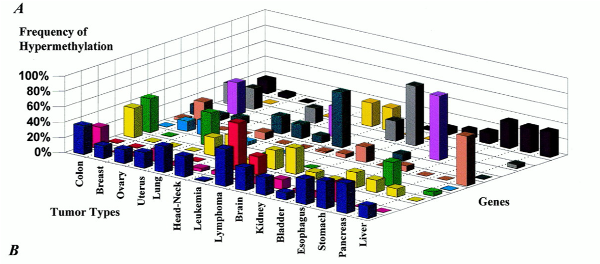

```{r setup, include=FALSE}
knitr::opts_chunk$set(echo = TRUE, message = FALSE, warning = FALSE)

```

# Question 0

*Please add your name and date to the R Markdown YAML header.

# Question 1 

### a) 

Read in the SAT data `sat_data.xls`. This data has information by state on the average verbal and math scores on the SAT for 2004 and 2005, and lists the participation percentage and region of each state. The SAT is an exam used for college applications, and higher scores imply better performance. Each section was scored from 200 to 800 in 2005.*

Clean the variable names to be easier to work with. Assume that "MathSAT_2005...5" refers to the math scores in 2005 and "MathSAT_2005...7" refers to the math scores in 2004.

```{r read sat}


```
### b)

Once the data has been read in and cleaned, creating two new variables which calculate the total SAT score for 2004 and 2005 for each state. 

```{r total score}


```


### c) 

Was there a relationship between verbal and math SAT scores in 2005? Create a graph to evaluate this question, and be sure to include appropriate labels for the axes. Comment on the relationship you see (or don't see). 

```{r v vs m}

```


### d) 

Calculate the average total score by region in 2004 and 2005. Which region had the lowest performance in 2004? Which had the best performance in 2004? What about 2005? You can refer to the regions using the abbreviations from the dataset. You can use `kable()` to print out and refer to your results. 

```{r region scores}

```


### e) 
Use the `case_when` function to create a new participation variable with three groups:

- "low" for participation less than 50% 

- "medium" for participation between 50% and 75% 

- "high" for participation higher than 75% 

```{r}

```

### f) 

Create a heatmap showing average performance in 2005 by region and your new participation variable. To do this, make a `ggplot` with `geom_tile`. The x aesthetic should be mapped to participation, the y aesthetic should be mapped to region, and the fill aesthetic should be mapped to performance. The geom_tile() geom will automatically calculate the average.  


```{r heat sat}


```

### g)

Improve the visualization of your heatmap by doing the following:

(1) Ensure that the plot has an appropriate title and that both axes and the legend are properly labeled. 
(2) Make sure the participation groups are presented in a logical order.
(3) Use a `theme()` statement to remove the grey panel background.
(4) Use a `theme()` statement to increase the axis text size to 14.

```{r heat improved}


```

# Question 2

It seems like it was very popular to create 3D bar graphs for studies of cancer genes in the mid 2000's. Here is another visualization from a peer-reviewed publish paper:


__Why was this so popular? No idea... but thankfully times have changed!__

### a)

I scraped the data from this figure so we could make a more modern version of this visualization. Load the cancer gene data from the "cancer_genes.csv" file, and make sure you check the data for any issues.

```{r cancer read}


```

### b)

Use what you learned from the SAT heatmap to create a heatmap visualization of hyper methylation for each tumor type + gene combination. Make sure your x-axis, y-axis, and fill legend are labeled correctly and give your plot a title. 

```{r}

```

### c)

Add `theme(axis.text.x = element_text(angle = 90))` to your plot -- what did this theme option do?

```{r}


```


### d)

Now add `scale_fill_gradient(high = "white", low = "darkred")` to your heatmap. What did this code do? Does it make sense to have `high = "white"` and `low = "darkred"`? If you think it does, leave it -- otherwise make a change that you think produces a better visualization.

```{r}


```


# Question 3

You have received a dataset of treatment compliance for a 10-week study on physical activity and cognitive functioning. This data set can be found in the `activity_compliance.csv` file. 

### a)

Load the compliance data in from the `activity_compliance.csv` file.

```{r activity read}

```

### b)

The data set contains missing compliance observations. For the purpose of this exercise, we will treat missing data as non-compliant. Change all NA compliance values to 0 and use this updated dataset for the following problems.

```{r}


```

### c)

Create a summary data frame of the proportion of compliant individuals per week and its 95% confidence interval. Report it using the `kable()` function.

```{r compliant summary}

```

### d)

The code skeleton below will create a graph that shows the proportion of compliant individuals and it's 95% confidence interval per week once you plug in your data frame and the variables for x, y, ymax, and ymin. The ymax and ymin aesthetics should be mapped to the upper and lower bounds of your calculated 95% Confidence interval.

Once you have plugged in these values, you should see a plot of proportions with error bars marking the 95% confidence intervals. We have also added additional statements to improve our plot. In a series of sentences, please describe what each statement does. You need to describe the 8 statements starting with `geom_pointrange` and ending with `annotate`. Hint: If you are stuck, try removing a statement and seeing what changes!

__When are done filling in the code, make sure to change the code chunk option below to eval = TRUE__


```{r, eval = TRUE}


ggplot(data = ) +   # Fill in the summary data frame you create
  geom_pointrange(aes(x = , y = , ymax = , ymin = )) +  # Fill in the x, y, ymax, and ymin aesthetics (ymax and ymin are for your CI's)
  geom_line(aes(x = , y = ), linetype = "dotted") +     # Fill in the x and y aesthetics (the same as above)
  geom_hline(aes(yintercept = 0.65), color = "darkblue", linetype = "dashed") +
  theme_bw() +
  labs(title = "Observed Proportion of Compliant Individuals by Week", x = "Week", y = "Proportion") +
  scale_x_continuous(breaks = 1:10, labels = paste("Week", 1:10)) +
  scale_y_continuous(limits = 0:1) +
  annotate(geom = "text", x = 8, y = 0.9, label = "Target Compliance = 0.65", color = "darkblue")


```


# Question 4

### a) 

Create a dataset made up of 100,000 random samples from a standard normal distribution (mean = 0, standard deviation = 1).

```{r disribute}


```

### b) 

Make an exploratory histogram and box-plot of the dataset from part (a). These two graphs can be simple and are meant to be produced quickly in a few lines of code, but the histogram should have enough bins to give a good sense of the distribution. __In your opinion, which of these two plot is more informative/easier to interpret?__

```{r random plots}


```


### c) 

Improve one of your two graphs from (b) by: (1) using a preset theme of your choice, (2) including appropriate labels for the x and y axes, (3) adding titles, (4), and setting both color and fill aesthetics. 

```{r nice histogram}

    

```


# Question 5

We will be using the now-familiar biometrics dataset which contains nine skeletal measurements and twelve girth measurements along with age, weight, height, and gender. 

### a) 

Load the biometrics data in from `biometrics.xls`.

```{r read bio}


```

### b) 

Create a smaller data-set that only includes `id`, `height`, `weight`, `gender`, and all the `girth` measurements. 

```{r selection}


```


### c) 

Create a new variable called `bmi` in this smaller dataset. BMI can be calculated as weight (in kg) divided by the square of height (in m). Notice that the height measurements have been recorded in cm. BMI is usually rounded to 1 decimal place -- so use the `round()` function. 

```{r BMI}


```


### d) 

A researcher you are working with is interested in a new measurement which is the sum of navel girth and thigh girth. Create this variable and graph its distribution. 

```{r girth}

```

### e) 

The same researcher is interested in whether there is a relationship between continuous BMI and their new navel + thigh girth variable. Plot a graph that will help you explore this potential relationship. Do you see a relationship?

```{r scatterplot}


```


### f) 

You're now interested in the proportion of individuals who would be classified into several BMI categories: 

- Underweight: BMI less than 18.5

- Normal: BMI greater than or equal to 18.5 but less than 25

- Overweight: BMI greater than or equal to 25 but less than 30

- Obese: BMI greater than or equal to 30.

Create a categorical variable that reflects these BMI categories. 

```{r BMI cat}

```

### g) 

Report the proportion of individuals who are in each BMI category within each gender. Please use the `kable()` function to print your summary.

```{r}

```

### h) 

Create a faceted scatterplot of BMI by navel + thigh girth by both BMI category and gender.

Ensure that your graph:

(1) Has an appropriate title and that both axes are properly labeled. 
(2) Presents the BMI groups in a logical (ascending or descending) order.

``` {r faceted plot}

```
          