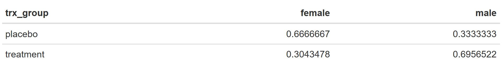

```{r setup, include=FALSE}
knitr::opts_chunk$set(echo = TRUE, message = FALSE, warning = FALSE)
library(tidyverse)
library(knitr)
library(readxl)
```

## Question 1

You have received data for a small observational study on OCD. Patients were measured using the YBOCS scale over eight months. The YBOCS data is saved in the `data/ocd_longitudinal.csv` file and some basic demographics are stored in the `data/ocd_demos.csv` file.

### a)

Load both datasets into R and join them using a method that will drop any individuals who are not in both datasets. Report the number of variables and the number of observations in this joined dataset.

```{r}


```

### b)

You want to produce a spaghetti plot which shows YBOCS scores over time for all individuals. In order to do this, you must transform the data from wide to long format. Use `pivot_longer()` to get the data into long format, and then create a spaghetti plot that displays all individuals' YBOCS trajectories over the eight months.

In your spaghetti plot, make sure that:
(a) the month variable is labeled "Month 1", "Month 2", etc. 
(b) the x and y axes are labeled and there is an appropriate title
(c) you have set the opacity (alpha) of the lines to something besides 1

```{r}
 


```

### c)

The investigators you are working with want to create a new categorical variable called `remission` which equals 1 if the YBOCS score is less than or equal to 15 and 0 otherwise. Use `mutate()` to create this new categorical variable in your long dataset.

```{r}


```

### d)

Next, create a plot that shows the binary `remission` variable over time for each individual. You can use `geom_tile()` to do this, with month mapped to the X axis, patient ID mapped to the Y axis, and fill mapped to the `remission` variable. This type of plot for a categorical variable is sometimes called a "lasagna" plot in contrast to the earlier "spaghetti" plot you created.

```{r}


```

### e)

Improve the lasagna plot from part (d) in the following ways:
(1) If you have not already, make your ID variable and your remission variable into factor variables when plotting.
(2) Add an appropriate title to the plot and add titles for the x and y axes.*
(3) Give the legend an appropriate title and place it at the bottom of the plot.*
(4) Make the panel background white or blank.*
(5) Manually set custom colors for the fill aesthetic.*
(6) Set the color aesthetic in geom_tile() equal to "black". Explain what you think this did!

```{r}


```

### f)

Create a new categorical age variable called `age_cat` with two categories: "minor" if the individual is less than 18 years old, and "adult" if the individual is 18 years old or greater. Now facet your plot from (e) by this `age_cat` variable. In your facet_wrap() statement, add a scales = "free" argument. Explain what this did.

```{r}


```

### g)

Facet your spaghetti plot in (b) by the new `age_cat` variable. Do you notice any differences in YBOCS score trajectories between adults and minors based on these spaghetti plots? Answer in a sentence.

```{r}


```

### h)

Combine your two faceted graphs (spaghetti plot + lasagna plot) from (f) and (g) using the **patchwork** package. Add a title to this combined plot. More information about the patchwork package can be found here: https://patchwork.data-imaginist.com/

```{r}


```


### i)

Investigators inform you that the key time windows for remission are months 6, 7, and 8. They want you to create an indicator variable for anyone who is in remission for 2 out of these 3 months. Create this indicator variable called `responder` and then create a faceted lasagna plot by this responder status to check that all of the responders are in remission for 2 out of these 3 months.

```{r}


```


## Question 2

### a)

A clinical trial is conducted to evaluate the efficacy of a new drug which claims to induce a growth spurt in adolescents. The researchers recruited 50 subjects for the study and they were randomized to either receive the study drug or a sugar pill. Height measurement (in inches) were recorded once a month, beginning at baseline, for 4 consecutive months. The data is contained in two files: `data/growth_demographics.csv` which contains the age and sex of the participants and `data/growth_outcomes.csv` which contains the treatment group and height measurements for each month

Read in the datasets and combine them to create a dataframe that contains all the study data.  

How many variables and observations does the new dataframe have? Please report this in a sentence.


```{r}


```


### b)

What are the proportions of males and females within each treatment group? Use the kable() function to reproduce the table below (you can see the table without knitting by clicking on the "table_temp.JPG" in the file viewer in the lower right. Hint: think about using pivot_wider().



```{r}


```


### c)

To facilitate visualization, the researchers want the data to be changed from wide to long. Use the appropriate pivot function to create two new variables: "month" and "height". How many variables and observations does the new data frame contain?

```{r}


```

### d)

Using the long data, create a spaghetti plot to visualize the longitudinal trends in height across month, and use a color mapping to differentiate between treatment groups. Describe any differences you see between individuals in the treatment groups.

```{r}

```


### e)

Make two boxplots using facet_wrap() to visualize the distribution of height across month and treatment group.

```{r}


```

### f)

After looking at your plots, what do you notice about the effect of time across both treatment groups? Does this make sense given the population and study question?


# Question 3

### a)

You have been asked to use the biometrics data stored in the `biometrics.xls` file to create a single scatterplot that shows age on the x axis and plots ankle girth, calf girth, knee girth, and wrist girth on the y axis simultaneously, with each girth measurement represented by a different colored point. You tell your supervisor this will likely be too much to show in one graph, but they insist you must produce it. 

Use pivot_longer() to prepare the data for this plot, and make sure your x-axis, y-axis, and legend labels have appropriate labels.

```{r}


```

### b)

Despite the excessive number of points, your supervisor asks you to add navel girth, hip girth, and thigh girth to this plot as well. Edit your pivot_longer call and add these to your scatterplot above. 

```{r}


```

### c)

Is there a better way to plot all of these relationships? Try to produce a better version of (b) that would allow the reader to more easily assess the relationships between age and each one of these girth measurements in a single plot. 

```{r}


```
