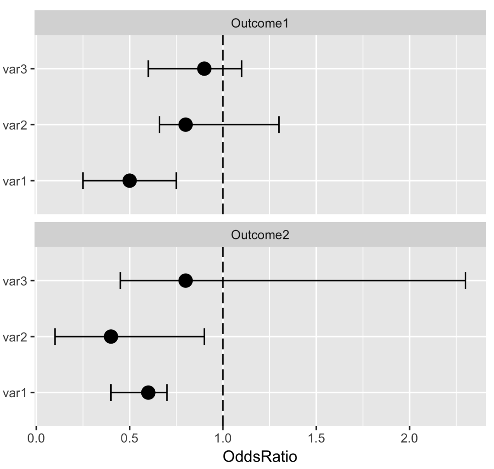

```{r setup, include=FALSE}
knitr::opts_chunk$set(echo = TRUE, message = FALSE, warning = FALSE)
library(tidyverse)
library(knitr)
library(broom)
library(car)
```

## Question 1

### a)

Read in the data "amazon_reviews.csv". The data contains information on consumer reviews for amazon products like the Kindle and Fire TV Stick from 2016 to 2018.

The original dataset is available at: https://www.kaggle.com/datafiniti/consumer-reviews-of-amazon-products/data.

```{r}


```

### b)

We are interested in modeling customer ratings given the information in our data. Use string manipulation functions to convert `rating` into a numeric variable. 

```{r}


```

### c)

We want to extract the year the review was submitted from the `date` variable. Use functions from the `stringr` package to obtain the year from the "year-month-day hour:minute:second" date variable.

```{r}


```


### d) 

We are interested in only analyzing reviews on the Kindle Fire. Use str_detect to filter the data to only include these observations. Hint: make sure to account for case sensitivity.

```{r}


```


### e)

Create an indicator variable called `title_type` that takes value "good" if the review title contains the word "good" or "great" (regardless of case) and "bad" if it does not.

```{r}


```

### f)

Identify a few key words that may indicate a positive review by skimming the review variable. Create another indicator variable called `review_type` that takes value "good" and "bad" based on the presence of these words in the review variable.

```{r}


```


### g)

Perform a multiple regression analysis to model the relationship between customer rating and year, type of title, and type of review. Since you created the `review_type` variable, your results will be unique. Please report the model R-squared and also print a table of intercept and slope parameter estimates using the `gtsummary` package. 

```{r}


```

### h)

Which variables in your model are significant? If they are significant, interpret the slope estimates for your `review_type` and `title_type` variables. What do you think you could do to improve your `title_type` or `review_type` variables to make them more accurate variables?


## Question 2

We will re-visit a similar data set from weekly R Videos in this question in order to practice using string manipulation functions and setting reference levels for categorical variables.

This dataset includes information on commute time (in minutes), rent (in dollars), and borough. The goal of this problem will to make a model that predicts commute time based on rent and borough. While the variable names are the same, the data values have changed from videos!

### a)

Load `commute_data.csv` into your R environment and take a look at the data. How many unique borough entries are there in the raw data? Use `stringr` functions to create a clean and corrected borough variable (`borough_cl`).


```{r}


```

### b)

Create a scatterplot of commute by rent, with different colors for different boroughs (using your cleaned borough variable). Make sure your plot has an informative title and labels for the x and y axes. This is a good way to check whether you have cleaned your borough variable. FYI: There are only five boroughs in NYC!

```{r}


```

### c)

Fit a linear regression model for commute with rent and borough as predictors. Don't explicitly specify the levels of your cleaned borough factor, let R do it for you. Report the overall model R-squared.

```{r}


```

### d)

Check the partial f-test for borough in your model and report whether the categorical borough variable is associated with commute time in minutes. 

```{r}


```

### e)

What borough did R automatically make the reference level? Report the slope parameter estimates for the model using `tidy()` and `kable()` and indicate which dummy variables are significant. For the significant dummy variables, interpret what the slope estimates mean. Remember that the outcome is commute time and consider the reference level in your answer.

```{r}


```

### f)

Nobody in NYC ever gives Staten Island enough respect! Use `factor()` to create a new borough variable whose reference level will be Staten Island. Now re-run the same regression model from part (c) using your new borough variable. Report the slope parameter estimates for the model using `tidy()` and `kable()` and indicate which dummy variables are significant. For the significant dummy variables, interpret what the slope estimates mean. Remember that the outcome is commute time and consider the reference level in your answer.

```{r}


```

## Question 3

We will be using the body measures dataset for this exploratory analysis. This question is more open-ended than usual -- we are interested in exploring associations between BMI categories and the skeletal/girth measurements in this dataset.

### a)

First, load the data in and create two binary variables: one for overweight or obese status (BMI >= 25) and another for obese status (BMI >= 30). We will be modeling each of these outcomes using logistic regression.

```{r}


```

### b)

Now explore the association between three skeletal/girth measurements of your choice and these two outcomes separately. This should result in fitting 6 logistic regression models: for each measurement you choose, you will fit one model with an outcome of obesity/overweight status and one model with an outcome of obesity status. You may choose to adjust for additional covariates (such as age or gender) in your models that explore each measurement/outcome relationship -- just remember to consider this in your later interpretations. Fit your models in the space below and print out the ORs for your fitted models using either `tidy()` + `kable()` or `tbl_regression()`.

```{r}


```

### c)

Report the results of your models in a series of sentences. Make sure that when you report the significant associations you found, you also include an interpretation of the estimated ORs.

### d)

Create a summary graph of the OR's and their 95% CI's for your measurements of interest. Your graph should look something like the one below. To put together this data, consider combining outputs from `tidy()` calls via `bind_rows()`.



For your graph, consider the following elements:

(1) You should present the estimated OR's for your skeletal/girth measurements of interest as points, with the 95% CI's as point ranges or as error bars (check out `geom_errorbar()` and `geom_pointrange()`). If you included other covariates in your earlier models, don't include them here -- only show the OR's for the skeletal/girth measurements.

(2) Your plot should include a dashed line at OR = 1, which represents the null.

(3) Your plot should be faceted so you show the OR's for one outcome in one facet and the OR's for the second outcome in the other facet.

(4) You should have more informative labels for the variables and outcomes than their variable names.

(5) Feel free to improve the overall look of the graph with better theme choices -- it does not have to be default grey theme as shown in the example.

## Question 4

Investigators are interested in whether overall milk production in lame dairy cows depends on the breed of the cows (Local Zebu, or Boran). During a small study, they followed 5 lame cows from each breed for 1 year and recorded their milk production in liters/month:

Local Zebu cows: 552, 616, 637, 563, 541 liters/month

Boran cows: 704, 739, 770, 748, 750 liters/month

### a) 

Enter this data into a tibble so that you will be able to manipulate it easily. There should be one column for the breed of cow, and one column for the milk measurements. You can do this by using the `tibble()` function or you can try the `tribble()` function (check out the help file on how to use it!).

```{r}


```


### b) 

**********THIS WAS NOT COVERED IN COURSE**********

Perform a __two-sided__ permutation test to test whether there are mean differences in lame milk production between Local Zebu and Boran cow breeds. Perform 1000 permutations for your test. Make sure to:

(1) Graph the distribution of your simulated test statistics for the 1000 permutations.

(2) Include a dashed vertical line marking the observed test statistic.

(3) Report the p-value and the result of your permutation test in a sentence.


```{r}


```

### c)

Perform two-sample t-tests (one with equal variance, one without equal variance) to test the means between cow breeds. Compare the p-value and decision to reject the null hypothesis with the p-value and decision to reject the null hypothesis based on your permutation test. 

```{r}


```

### d) 

**********THIS WAS NOT COVERED IN COURSE**********

Perform a __one-sided__ permutation test to test whether there are median differences in lame milk production between Local Zebu and Boran cow breeds. Perform 5000 permutations for your test. Make sure to:

(1) Graph the distribution of your simulated test statistics for the 5000 permutations.

(2) Include a dashed vertical line marking the observed test statistic.

(3) Report the p-value and the result of your permutation test in a sentence.

```{r}


```


